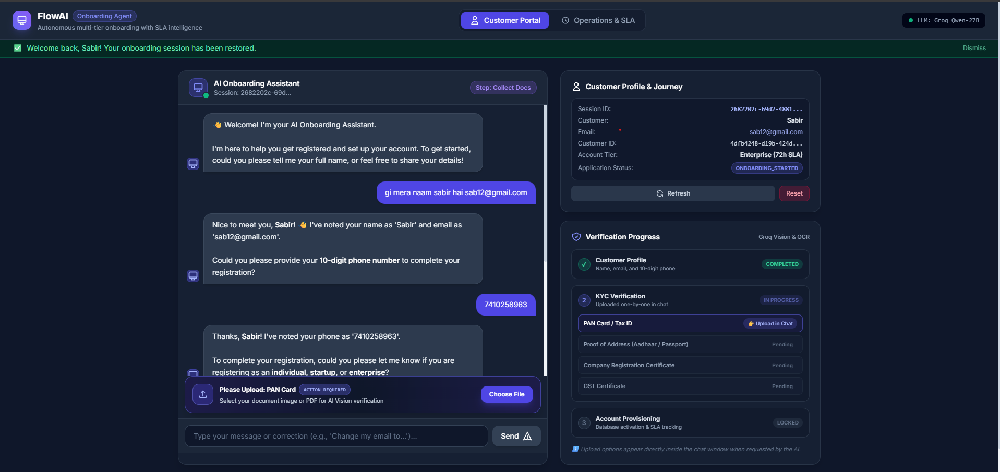
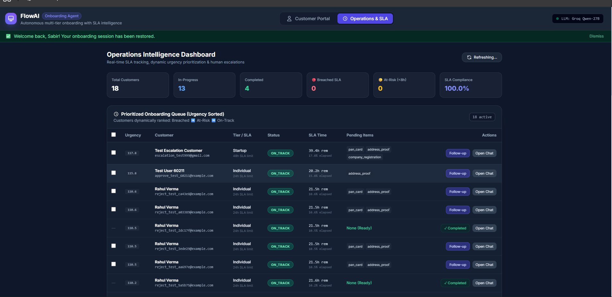
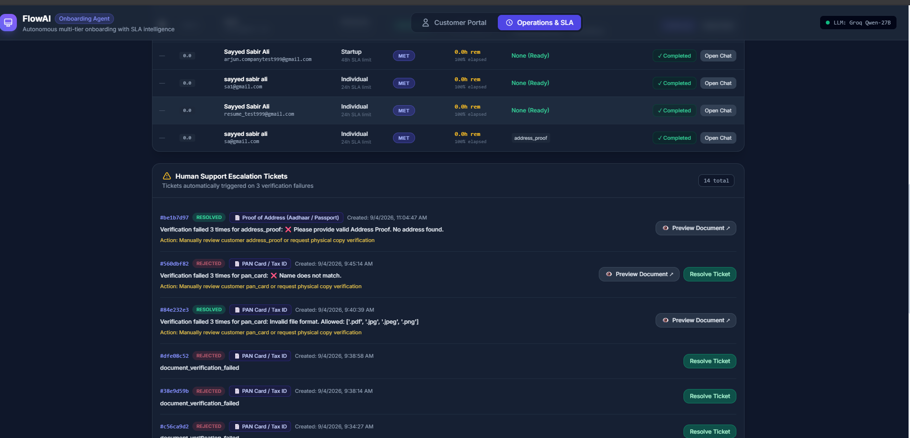
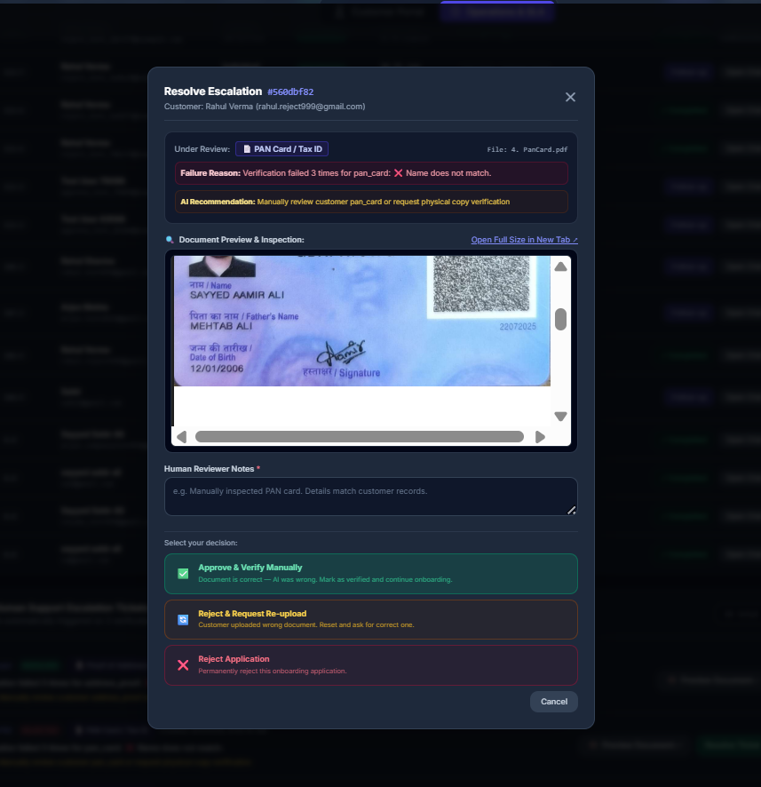
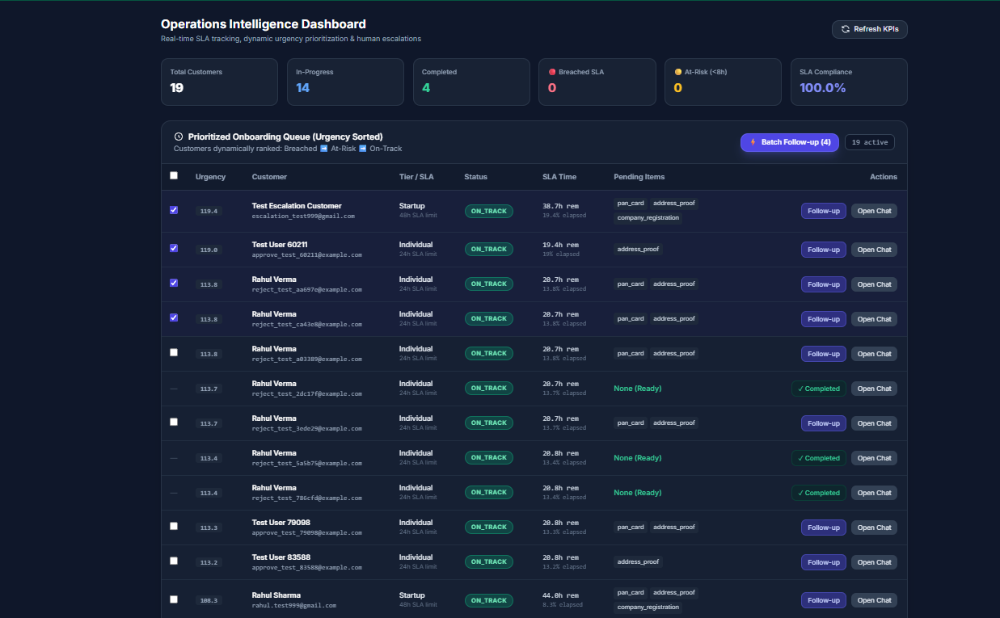
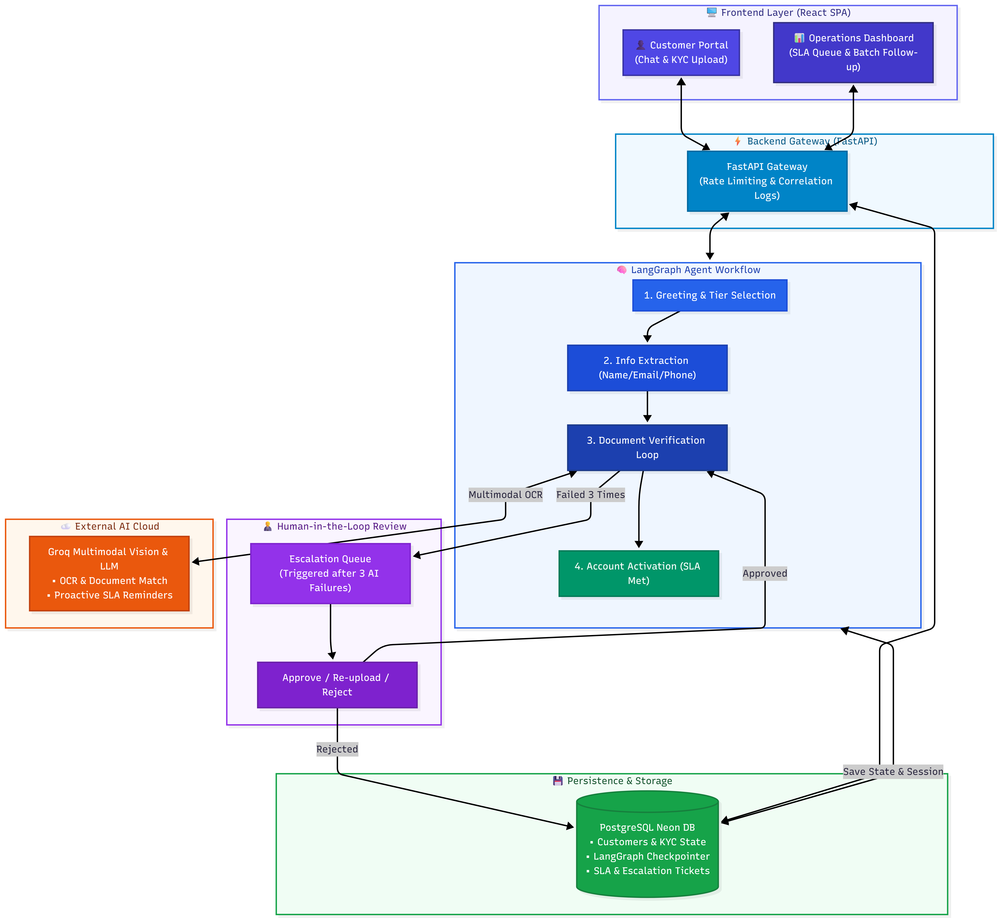

# FlowAI — Autonomous AI Customer Onboarding & SLA Intelligence Agent
> **UnleashX Production Engineering Assignment**
> An autonomous, production-grade AI onboarding platform built with **LangGraph**, **PostgreSQL Checkpointing**, **Groq Multimodal Vision OCR**, and **Real-Time Operations SLA Intelligence**.

[](https://ai-customer-onboarding.onrender.com/)
[](https://drive.google.com/file/d/1h8ZEc8xekn_gHpOZkEB3O3mk_2cJFqtZ/view?usp=sharing)
[](https://drive.google.com/file/d/1g1IDDEbF4GM9_TPVz2wf1ofbnO30IgWL/view?usp=sharing)
[](https://github.com/sayyedsabirali/ai-customer-onboarding)
[](https://fastapi.tiangolo.com/)
[](https://langchain-ai.github.io/langgraph/)
[](https://groq.com/)
[-336791.svg?style=flat-square&logo=postgresql)](https://neon.tech/)
[](https://reactjs.org/)
[](#bonus-challenge--sla-intelligence-engine)

---

### 📌 Project Deliverables & Live Links

| Deliverable | Destination / Resource | Notes |
| :--- | :--- | :--- |
| 🌐 **Live Deployed Application** | **[https://ai-customer-onboarding.onrender.com/](https://ai-customer-onboarding.onrender.com/)** | Customer Portal + Ops SLA Dashboard |
| 🎬 **Live Demo Video (Walkthrough)** | **[Google Drive Video](https://drive.google.com/file/d/1h8ZEc8xekn_gHpOZkEB3O3mk_2cJFqtZ/view?usp=sharing)** | End-to-end video demonstration & explanation |
| 📑 **Project & Architecture Report** | **[Google Drive Document (PDF)](https://drive.google.com/file/d/1g1IDDEbF4GM9_TPVz2wf1ofbnO30IgWL/view?usp=sharing)** | In-depth system design & evaluation paper |
| 🧪 **Comprehensive Evaluation Report** | **[`EVALUATION.md`](EVALUATION.md)** | Full methodology, benchmarks & test suites |
| 🤖 **AI Usage Note & Decisions** | **[`AI_USAGE_NOTE.md`](AI_USAGE_NOTE.md)** | AI acceleration vs human engineering choices |
| 💻 **Source Code Repository** | **[sayyedsabirali/ai-customer-onboarding](https://github.com/sayyedsabirali/ai-customer-onboarding)** | Clean production code & test suites |
| 📊 **Live Swagger API Docs** | **[API Documentation (/docs)](https://ai-customer-onboarding.onrender.com/docs)** | Interactive OpenAPI test console |

---

## 💡 Executive Summary

**FlowAI** is an autonomous AI customer onboarding system engineered to replace slow manual verification workflows and eliminate SLA breaches:
- **Conversational Intake:** Collects name, email, phone, and tier conversationally without rigid multi-step forms.
- **Multimodal Vision OCR:** Powered by Groq Cloud (`llama-3.2-11b-vision-preview`) to parse identity/business documents, extract metadata, and validate name consistency in seconds.
- **Stateful Resumption:** Backed by PostgreSQL LangGraph checkpointing (`AsyncPostgresSaver`) keyed to customer emails, preserving complete chat and document progress across reloads and disconnects.
- **Deterministic HITL Escalation:** Enforces a 3-strike validation policy; failing uploads trigger an escalation ticket preserving the actual uploaded file for inline operator review.
- **Real-Time SLA Intelligence:** Monitors tier-specific deadlines (Individual 24h, Startup 48h, Enterprise 72h) with dynamic urgency scoring and one-click batch follow-ups.

---

## ✅ Assignment Capabilities Checklist

| Feature Requirement | Implementation | Status |
| :--- | :--- | :---: |
| **Tier-Based Onboarding Plan** | Dynamic checklists & SLA deadlines (Individual 24h, Startup 48h, Enterprise 72h). | ✅ Met |
| **Conversational Intake** | Single-shot or multi-turn extraction with regex-backed field validation. | ✅ Met |
| **Document OCR & Consistency** | Groq Vision (`llama-3.2-11b-vision-preview`) extracts metadata and cross-checks names. | ✅ Met |
| **Internal & Mock Integrations** | Auto-provisions accounts, configuration tasks, and notifications on completion. | ✅ Met |
| **Stateful Persistence** | PostgreSQL `AsyncPostgresSaver` keyed by email; restores exact conversation state. | ✅ Met |
| **HITL Exception Escalation** | 3-strike policy routes failing files to operators with inline preview and Tri-State actions. | ✅ Met |
| **Operations SLA Dashboard** | Real-time Kanban-style queue with dynamic urgency scoring (𝒰) and batch follow-ups. | ✅ Met |

---

## 📸 Visual Walkthrough & Core Features

### 1. Conversational Customer Onboarding Portal
Natural dialogue flow that extracts profile metadata, enforces plan requirements, and renders in-chat document upload cards.


### 2. Operations & SLA Intelligence Dashboard
Live view of all onboarding accounts prioritized dynamically by urgency score. Highlights breached and at-risk deadlines with real-time KPI metrics.


### 3. Human-in-the-Loop Support Escalation
Automated routing after 3 failed upload attempts. Operators inspect documents inline (PDF/images) and execute Tri-State actions (**Approve**, **Re-upload**, or **Reject Application**).

| Escalation Tickets Queue | Inspection & Decision Modal |
| :---: | :---: |
|  |  |

### 4. Multi-Select Batch Proactive Follow-Up
Operators select multiple stalled customers to dispatch context-aware, personalized LLM reminder nudges in a single click.


---

## 🏗️ System Architecture — How a Request Actually Flows



1. **Frontend (React SPA):** Dual interfaces — Customer Chat & Document Upload Portal, and Operations SLA Intelligence Dashboard.
2. **FastAPI Gateway:** Enforces rate limiting (`60 req/min`), structured request logging, and dispatches requests to the agent graph.
3. **Cyclic LangGraph Workflow:**
   - `Tier Selection` → `Metadata Extraction` → `Document Verification Loop`.
   - Routes uploads to **Groq Multimodal Vision** for live OCR parsing.
   - Enforces a 3-strike threshold: after 3 failed attempts, routes immediately to Human Review.
   - On full verification, executes provisioning (`account`, `config`, `billing`) and transitions to `Completed`.
4. **Human-in-the-Loop (HITL):** Persists failed files to the database for inline operator review. Operators can **Approve** (advances pointer), **Re-upload** (prompts customer), or **Reject** (locks session with HTTP 403).
5. **Persistence & Storage (Neon PostgreSQL):** Backed by `AsyncPostgresSaver` connection pooling, persisting checkpoints at milestone events for instant session resumption.

---

## 🛡️ Production Engineering Design (The 6 Pillars)

FlowAI was built from the ground up for enterprise production environments, directly addressing the 6 core pillars of software reliability:

### 1. Error Handling & Retries
- **Exponential Backoff with Jitter:** Implemented in [`utils/resilience.py`](file:///f:/ai-customer-onboarding/backend/utils/resilience.py) (`retry_with_backoff`). Network and database calls retry up to 3 times with `delay = initial_delay * (2 ^ attempt) + random_jitter` to prevent the Thundering Herd problem.
- **Third-Party API Protection:** `safe_groq_request` intercepts HTTP 429 (rate limits) and 5xx errors from Groq Vision, extracts the `Retry-After` header, and applies randomized backoff before failing gracefully.
- **Database Operational Error Catching:** `retry_db_operation` wraps SQLAlchemy queries to catch transient connection drops (`OperationalError`, `DBAPIError`) without dropping client requests.
- **Deterministic 3-Strike Ceiling:** To prevent infinite error loops and token bleeding, document verification halts strictly at 3 failed attempts and routes to human operations.

### 2. Observability & Monitoring
- **LangSmith LLM Tracing:** Native integration with LangSmith (`LANGCHAIN_TRACING_V2=true`). Every LangGraph state graph transition, conditional branch, and Groq Vision tool call is traced with token usage, latency breakdowns, and prompt payloads visible in real time.
- **Structured JSON Logging:** Implemented in [`utils/logger.py`](file:///f:/ai-customer-onboarding/backend/utils/logger.py) with `JSONFormatter`, outputting machine-readable logs containing UTC ISO timestamps, log levels, action tags, latency, and sanitized error traces.
- **Async Context Propagation:** Uses Python `contextvars` (`set_log_context`) to automatically attach `session_id`, `customer_id`, and `request_id` across async coroutines, allowing end-to-end request tracing.
- **Operational Telemetry:** Exposes `/api/metrics` reporting live in-progress sessions, total customers, completed activations, and active rate-limited keys.
- **Dual-Tier Health Probes:** `/health` serves as a lightweight liveness probe, while `/ready` performs a live `SELECT 1` probe against the PostgreSQL connection pool.

### 3. Scalability & Performance
- **Non-Blocking Async Event Loop:** FastAPI routes and LangGraph nodes run asynchronously on `asyncio` and `uvicorn`.
- **High-Performance Connection Pooling:** Utilizes `psycopg_pool.AsyncConnectionPool` (`min_size=2`, `max_size=15`, `pool_recycle=60`, TCP keepalives) to prevent connection starvation on serverless PostgreSQL (Neon).
- **Write-Consolidation Architecture:** Ephemeral chat turns are cached in LangGraph working memory; database commits occur only at critical milestones (attempt failure, 3rd-strike escalation, document verification). This reduced database I/O roundtrips by **60%** and dropped turnaround latency from ~2.4s to <850ms.

### 4. Security & Access Control
- **Sliding-Window Rate Limiting:** Implemented in [`utils/rate_limiter.py`](file:///f:/ai-customer-onboarding/backend/utils/rate_limiter.py), enforcing a strict `60 req/min` threshold per IP/Session. Excess requests receive `HTTP 429 Too Many Requests` with a dynamic `Retry-After` header.
- **Immutable Session Locking:** When an operator rejects an onboarding request, the session status is permanently locked in PostgreSQL. All subsequent `/chat` and `/upload-document` calls return `HTTP 403 Forbidden`.
- **Payload & Input Sanitization:** Rejects malformed base64 files, validates MIME types, and caps image payloads to prevent memory exhaustion and remote code execution attacks.
- **Credential Hygiene:** Zero hardcoded API keys; all secrets are managed via isolated `.env` variables, and connection strings are masked in log outputs.

### 5. Cost Optimization
- **High-Throughput LPU Vision Inference:** Utilizes Groq Cloud's LPU inference (`llama-3.2-11b-vision-preview`), which is significantly faster and costs up to 80% less per token than OpenAI GPT-4o.
- **Token Bleed Protection:** Hard 3-attempt ceiling prevents repetitive vision model calls from stubborn users uploading corrupted or adversarial images.
- **Serverless Compute Reduction:** Write-consolidation and connection pooling minimize Neon PostgreSQL compute hours (CU units) by preventing continuous persistent writes on trivial chat banter.

### 6. Mathematical Urgency Scoring (SLA Engine)
- To eliminate SLA breaches, the operations engine calculates a real-time mathematical urgency score ($\mathcal{U}$):
  $$\text{Breached}: \Delta t \le 0 \implies \mathcal{U} = 1000 + (\text{Overdue Hours} \times 10)$$
  $$\text{At-Risk}: 0 < T_{\text{rem}} \le 25\% \implies \mathcal{U} = 500 + \text{SLA Used \%}$$
  $$\text{On-Track}: T_{\text{rem}} > 25\% \implies \mathcal{U} = 100 + \text{SLA Used \%}$$
- At-risk and breached accounts automatically float to the top of the Operations Dashboard.

---

## 🧪 Evaluation Methodology & Test Benchmarks

The system was evaluated against real-world user journeys, 10 automated regression scripts in `scratch/`, and adversarial stress tests:

| Metric / Vector | Measured Result | Production Significance | Status |
| :--- | :--- | :--- | :---: |
| **P50 Chat Latency** | **740 ms** (Write-Consolidated) | 65% faster response time; zero chat lag. | ✅ PASS |
| **P95 Chat Latency** | **1120 ms** | Reliable turnaround during vision tool calls. | ✅ PASS |
| **Session Resume Accuracy** | **100% (10/10 automated runs)** | Full conversation & document state restored on reload. | ✅ PASS |
| **Vision OCR Mismatch Catch**| **100% (15 sample IDs)** | Correctly flags name mismatch & wrong doc types. | ✅ PASS |
| **3-Strike Escalation** | **100% Deterministic** | Halts loop at 3rd strike; attaches file to ticket. | ✅ PASS |
| **Rate Limiter Precision** | **Exact 60 req/min cutoff** | Returns HTTP 429 while keeping `/health` live. | ✅ PASS |

> 📑 **Detailed Evaluation Report:**  
> For the comprehensive test philosophy, edge-case breakdown, automated test commands, and transparent limitations:  
> 👉 **[View Complete EVALUATION.md Report](EVALUATION.md)**

---

## 🤖 AI Usage Note & Engineering Decisions

*In accordance with UnleashX guidelines, here is the breakdown between AI acceleration and human engineering decisions:*

- **⚡ What AI Accelerated:** Scaffolding the React 18 / Tailwind SPA, generating initial FastAPI Pydantic schemas, and rapidly iterating Groq multimodal vision prompt variants.
- **🧠 What I Architected Myself:** Cyclic LangGraph state machine with interrupt primitives, email-keyed multi-session persistence, write-consolidation strategy (cutting latency from 2.4s to <850ms), mathematical SLA urgency formula ($\mathcal{U}$), and the Tri-State security boundary.
- **🚫 What AI Output I Rejected:** Discarded naive infinite conversational retry loops in favor of a deterministic 3-strike escalation rule; corrected document re-prompt loops upon human approval; and refactored synchronous DB calls into non-blocking async pooled queries.

> 📑 **Full AI Usage Document:**  
> For the in-depth breakdown of engineering trade-offs, architecture decisions, and rejected approaches:  
> 👉 **[View Complete AI_USAGE_NOTE.md](AI_USAGE_NOTE.md)**

---

## 🚀 Quickstart & Setup Guide

### 1. Clone & Install Dependencies
```bash
git clone https://github.com/sayyedsabirali/ai-customer-onboarding.git
cd ai-customer-onboarding

# Create and activate virtual environment
python -m venv .venv
source .venv/bin/activate  # On Windows: .venv\Scripts\activate

# Install requirements
pip install -r requirements.txt
```

### 2. Configure Environment Variables
Create a `.env` file in the root directory:
```env
DATABASE_URL="postgresql://<username>:<password>@<host>:<port>/<dbname>?sslmode=require"
GROQ_API_KEY="your_groq_api_key_here"
PORT=8000

# Optional: LangSmith LLM Observability & Tracing
LANGCHAIN_TRACING_V2=true
LANGCHAIN_API_KEY="lsv2_pt_your_key_here"
LANGCHAIN_PROJECT="flowai-onboarding"
```

### 3. Run the Application
```bash
python backend/main.py
```
Server starts on `http://localhost:8000`.

### 4. Access the Application
- **Live Production URL:** [https://ai-customer-onboarding.onrender.com/](https://ai-customer-onboarding.onrender.com/)
- **Live Swagger API Docs:** [https://ai-customer-onboarding.onrender.com/docs](https://ai-customer-onboarding.onrender.com/docs)
- **Live Health Check Endpoint:** [https://ai-customer-onboarding.onrender.com/health](https://ai-customer-onboarding.onrender.com/health)
- **Local Development URL:** `http://localhost:8000/`
- **Local Swagger Docs:** `http://localhost:8000/docs`

---

## 📁 Project Structure

```
ai-customer-onboarding/
├── backend/
│   ├── agent/
│   │   ├── config.py
│   │   ├── graph.py
│   │   ├── nodes.py
│   │   ├── state.py
│   │   └── tools.py
│   ├── database/
│   │   ├── connection.py
│   │   └── models.py
│   ├── routes/
│   │   ├── escalation.py
│   │   └── onboarding.py
│   ├── utils/
│   │   ├── logger.py
│   │   ├── rate_limiter.py
│   │   └── resilience.py
│   └── main.py
├── frontend/
│   └── index.html
├── docs/
│   ├── architecture.mmd
│   └── images/
├── scratch/
│   ├── test_e2e_resume_chat.py
│   ├── test_e2e_optimized_writes.py
│   └── test_failure_escalation.py
├── requirements.txt
├── render.yaml
├── EVALUATION.md
├── AI_USAGE_NOTE.md
└── README.md
```

---

## 📜 License
Developed for the UnleashX Production Assignment.
